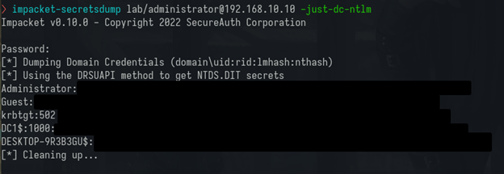

# Table of Contents

- [Statement of Confidentiality](#statement-of-confidentiality)

- [Engagement Contacts](#engagement-contacts)

- [Executive Summary](#executive-summary)

  - [Approach](#approach)

  - [Scope](#scope)

  - [Assessment Overview and Recommendations](#assessment-overview-and-recommendations)

- [Network Penetration Test Assessment Summary](#network-penetration-test-assessment-summary)

  - [Summary of Findings](#summary-of-findings)

- [Internal Network Compromise Walkthrough](#internal-network-compromise-walkthrough)

  - [Detailed Walkthrough](#detailed-walkthrough)

- [Remediation Summary](#remediation-summary)

  - [Short Term](#short-term)

  - [Medium Term](#medium-term)

  - [Long Term](#long-term)

- [Technical Findings Details](#technical-findings-details)

  - [1. Vulnerability Name Here](#vulnerability-name-here)

- [Appendices](#appendices)

  - [Appendix A - Finding Severities](#appendix-a-finding-severities)

  - [Appendix B - Exploited Hosts](#appendix-b-exploited-hosts)

  - [Appendix C - Compromised Users](#appendix-c-compromised-users)

  - [Appendix D - Host Cleanup](#appendix-d-host-cleanup)

# Statement of Confidentiality

\[Company Name\] developed the contents of this document. The contents of this document are considered proprietary and business confidential by \[Company Name\]. This information is only to be used for the purpose for which it was intended. This document may not be released to another vendor, business partner or contractor without prior written consent from \[Company Name\]. Furthermore, no part of this document may be communicated, reproduced, copied, or distributed without the prior written permission of \[Company Name\].

This document\'s contents do not represent legal advice. The services provided by \[Company Name\] in relation to compliance, litigation, or other legal issues are not meant to be legal advice and should not be construed as such.

# Engagement Contacts

Our contact information:

|      [Client Name] Contacts     |                                |                                   |
|---------------------------------|--------------------------------|-----------------------------------|
|     Primary Contact             |     Title                      |     Primary Contact Email         |
|     Name Here                   |     Chief Executive Officer    |     name@[Company Name].local     |
|     Secondary Contact           |     Title                      |     Secondary Contact Email       |
|     Name Here                   |     Chief Technical Officer    |     name@[Company Name].local     |

Our security consultant contact information:

|      Assessor Contacts     |                            |                                   |
|----------------------------|----------------------------|-----------------------------------|
|     Assessor Name          |     Title                  |     Assessor Contact Email        |
|     [Company Name]         |     Security Consultant    |     name@[Compnay Name].local     |


# Executive Summary

\[Client Name\] has hired \[Company Name\] to do a Network Penetration Test on \[Client Name\]\'s internal network to detect security flaws, assess the impact on \[Client Name\], document all findings in a clear and repeatable manner, and give remediation recommendations.

## Approach

\[Company Name\] tested using a \"black box\" method from April 20,2023, to April 30, 2023, with no credentials or prior knowledge of \[Client Name\]\'s internally facing environment, with the purpose of uncovering unknown weaknesses. Testing was conducted in a non-evasive manner to find as many misconfigurations and vulnerabilities as feasible. Testing was carried out remotely on a host that had been set up particularly for this purpose. Each identified flaw was documented and carefully investigated to identify exploitation and escalation potential. \[Company Name\] attempted to demonstrate the entire scope of each vulnerability, including internal domain compromise. If \[Company Name\] was successful in gaining access to the internal network, \[Client Name\]permitted additional testing such as lateral movement and horizontal/vertical privilege escalation to illustrate the impact of an internal network intrusion.

## Scope

The scope of this assessment was one internal network range and the \[CLIENT NAME\].LOCAL Active Directory domain.

|      Host/URL/IP Address     |      Description                        |
|------------------------------|-----------------------------------------|
|     192.168.10.0/24          |     [Client Name] internal   network    |

## Assessment Overview and Recommendations

Everything that was found in the assessment and the recommendations goes here. 

# Network Penetration Test Assessment Summary

All testing procedures were started by \[Company Name\] from the standpoint of an unauthorized user on the internal network. Network ranges were given to the tester by \[Client Name\], but no further details, such as the operating system or configuration information, were given.

## Summary of Findings

\[Company Name\] discovered a total of \[number\] (x) results that represent a material risk to \[Client Name\]\'s information systems during the assessment. \[Company Name\] also discovered one informational discovery that, if addressed, might improve \[Client Name\'s\] overall security posture. Informational results are observations for the organization\'s areas of improvement and do not
reflect security issues on their own. The table below summarizes the findings by severity level.

|      Finding Severity     |               |            |              |
|---------------------------|---------------|------------|--------------|
|     High                  |     Medium    |     Low    |     Total    |
|     x                     |     x         |     x      |     x        |

Each finding discovered throughout testing is summarized below. These findings are discussed in detail in the report\'s Technical Findings Details section.

# Internal Network Compromise Walkthrough

Brief description of the course of the assessment.

## Detailed Walkthrough

This section also includes the reproduction steps that include screenshots, tables, and any evidence goes here. It's important to filter sensitive information with black boxes in screenshots while in snippets highlight critical information with a color and redact potential sensitive information as well.


Here's a screenshot that contains sensitive information.



We could make black boxes to filter sensitive information.

Here's a table that contains critical information.

```sh
~
❯ sudo responder -I eth0 -wd  
                                         __
  .----.-----.-----.-----.-----.-----.--|  |.-----.----.
  |   _|  -__|__ --|  _  |  _  |     |  _  ||  -__|   _|
  |__| |_____|_____|   __|_____|__|__|_____||_____|__|
                   |__|

           NBT-NS, LLMNR & MDNS Responder 3.1.3.0

<SNIP>

[+] Generic Options:
    Responder NIC              [eth0]
    Responder IP               [192.168.10.132]
    Responder IPv6             [fe80::20c:29ff:fe3e:682c]
    Challenge set              [random]
    Don't Respond To Names     ['ISATAP']

[+] Current Session Variables:
    Responder Machine Name     [WIN-5EDPG7Z4ZW2]
    Responder Domain Name      [NM58.LOCAL]
    Responder DCE-RPC Port     [46767]

[+] Listening for events...

<SNIP>

[SMB] NTLMv2-SSP Client   : 192.168.10.10
[SMB] NTLMv2-SSP Username : LAB\Administrator
[SMB] NTLMv2-SSP Hash     : Administrator::LAB:2b9794b031df5065:F84178xxxxxxxxxxxxxxxxxxx0B7EFE237A17:010100000000000000554CB6567BD9013E9211DCEED8A69D00000000020008004E004D003500380001001E00570049004E002D003500450044005000470037005A0034005A005700320004003400570049004E002D0035004500440050004xxxxxxxxxxxxxxxxxxxxxxxxxxxxxx002E004C004F00430041004C00030014004E004D00350038002E004C004F00430041004C00050014004E004D00350038002E004C004F00430041004C000700080000554CB6567BD901060004000xxxxxxxxxxxxxxxxxxxxxxxx0000340EABE461FC4D90B5820F4657C2C3C59ECAA3BA65BCE0B1268BFFA73FCC2530A001000000000000000000000000000000000000900260063006900660073002F003100390032002E003100360038002E00310030002E003100330032000000000000000000

<SNIP>
```

It's essential to replace some characters in a hash to avoid potential misuse of the hash.

We can also redact information such as follows.

```sh
❯ bloodhound-python -u 'administrator' -p '<REDACTED>' -d lab.local -ns 192.168.10.10 -c All
INFO: Found AD domain: lab.local
INFO: Getting TGT for user
<SNIP>
INFO: Connecting to LDAP server: dc1.lab.local
INFO: Found 1 domains
INFO: Found 1 domains in the forest
INFO: Found 2 computers
INFO: Connecting to LDAP server: dc1.lab.local
INFO: Found 4 users
INFO: Found 52 groups
INFO: Found 3 gpos
INFO: Found 1 ous
INFO: Found 22 containers
INFO: Found 0 trusts
INFO: Starting computer enumeration with 10 workers
INFO: Querying computer: DESKTOP-9R3B3GU.lab.local
INFO: Querying computer: DC1.lab.local
INFO: Skipping enumeration for DESKTOP-9R3B3GU.lab.local since it could not be resolved.
INFO: Done in 00M 01S

```


# Remediation Summary

This evaluation has revealed several ways in which \[Client Name\] can improve the security of its internal network. The following lists the remediation actions in order of priority, starting with those that will probably require the least time and effort to execute. To avoid any service interruptions or data loss, \[Client Name\] should make sure that all corrective actions and mitigating controls are well planned and
tested.

## Short Term

-   Finding x -- Description goes here

## Medium Term

-   Finding x -- Description goes here

## Long Term

-   Finding x -- Description goes here

# Technical Findings Details

This section contains the details of the vulnerabilities found during the assessment.

## Vulnerability Name Here

|      CWE                   |      CWE-522                                  |
|----------------------------|-----------------------------------------------|
|     CVSS 3.1 Score         |     9.5                                       |
|     Description            |     Description of the vulnerability here.    |
|     Security Impact        |     The impact of the vulnerability here.     |
|     Affected Domain        |     CLIENT NAME.LOCAL                         |
|     Remediation            |     Remediation steps goes here.              |
|     External References    |     References goes here                      |

**Finding Evidence:**

The evidence of the vulnerability reported goes here.

# Appendices

## Appendix A -- Finding Severities

There are three severity categories for each finding: high, medium, and low. The evaluation is based on a determination of the importance of each result and the possible effects they may have on the privacy, availability, and integrity of \[Client Name\]\'s data.

|      Rating     |      Severity Rating Definition     |
|-----------------|-------------------------------------|
|     High        |     Description goes here.          |
|     Medium      |     Description goes here.          |
|     Low         |     Description   goes here.        |

## Appendix B -- Exploited Hosts

|      Host            |      Scope      |      Method      |      Notes                     |
|----------------------|-----------------|------------------|--------------------------------|
|     192.168.10.10    |     Internal    |     Name Here    |     Domain compromise          |
|     192.168.10.25    |     Internal    |     Name Here    |     Domain lateral movement    |
|     192.168.10.90    |     Internal    |     Name Here    |     Initial Foothold           |


## Appendix C -- Compromised Users

|      Username     |      Type     |      Method      |      Notes                                     |
|-------------------|---------------|------------------|------------------------------------------------|
|     eburton       |     Domain    |     Name Here    |     Standard Domain User                       |
|     aamawashi     |     Domain    |     Name Here    |     Local Admin on SQL01                       |
|     khodaka       |     Domain    |     Name Here    |     System Administrator with DCSync rights    |

## Appendix D -- Host Cleanup

|      Host            |      Scope      |      Cleanup                                      |
|----------------------|-----------------|---------------------------------------------------|
|     192.168.10.10    |     Internal    |     Mimikatz file in X \|   md5sum: <HashHere>    |
|     192.168.10.25    |     Internal    |     Rubeus file in X \|   md5sum: <HashHere>      |